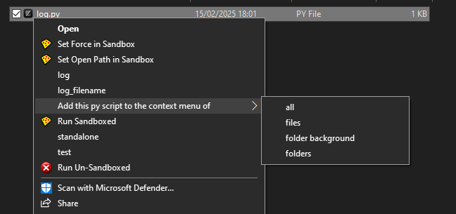

<div align="center">
   <h1>
        PyContextMenu 🖱️
       
   </h1>
    <h3>Add Python Scripts to the Windows Context Menu</h3>
</div>

<br/>

<div align="center">
    PyContextMenu allows you to easily add Python scripts to the Windows context  <br>
    menu (right-click menu) for files, folders, and the background. <br>
</div>

<br/>


<p align="center">
    
</p>


## Functionality

`PyContextMenu.py` handles both installing the main context menu entry and adding individual Python scripts to it. It uses command-line arguments to determine its function.

## Installation and Usage

1. Clone the repository:
    ```bash
    git clone [https://github.com/pablo-s-dev/PyContextMenu.git](https://github.com/pablo-s-dev/PyContextMenu.git)
    ```

2. Navigate to the project directory:
    ```bash
    cd PyContextMenu
    ```

3. **To install the main "PyContextMenu" entry:**
    ```bash
    python PyContextMenu.py
    ```
    (Run without any additional arguments.)

4. **To add a Python script to the context menu:**

There are two ways to add a Python script to the context menu:

### Method 1: Using the PyContextMenu Entry in the Context Menu

1.  Right-click on the Python script you want to add.

2.  Select "PyContextMenu" -> "Add this py script to the context menu of".

3.  Choose the desired location(s) for the context menu entry (files, folders, background, or all).


### Method 2: Using the Command Line

1. Open a command prompt or PowerShell window.

2. Navigate to the project directory.

3. Run the script with the following command-line arguments:

    ```bash
    python PyContextMenu.py "C:\path\to\your\script.py" [option]
    ```

    *   `"C:\path\to\your\script.py"`: The absolute path to the Python script. Use double quotes, especially if the path contains spaces.
    *   `[option]`: Specifies where the context menu entry should appear:
        *   `--files`: For all files.
        *   `--folders`: For folders.
        *   `--background`: For the folder/desktop background.
        *   `--all`: For all three (files, folders, and background).

**Example:**

```bash
python PyContextMenu.py "C:\My Scripts\my_script.py" --all
```


## How to Use Your Scripts

After adding a script, right-click on a file, folder, or the background and select "[Your script name]". 
The script will be executed using the Python interpreter that it is in your path.

## Important Considerations

  * **Path argument:** Your Python Scripts will receive the path of the folder/file clicked as the second argument.

## Contributing

Contributions are welcome! Please open an issue or submit a pull request.
